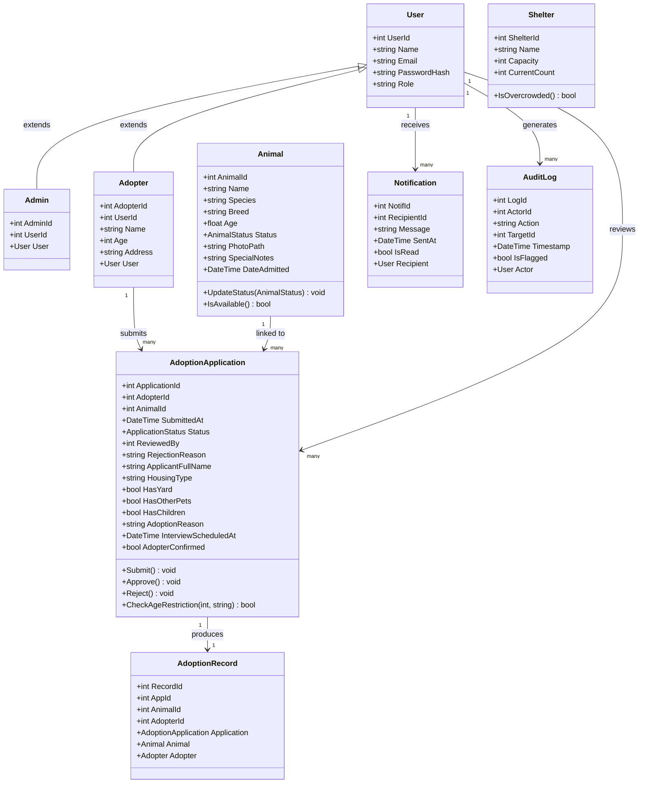

# 🐾 ShelterLink

> A web-based animal shelter management and adoption platform built with ASP.NET Core and MySQL.

---

## Project Title

# ShelterLink — Animal Shelter Adoption Management System

---

## Project Description & Purpose

**ShelterLink** is a full-stack web application designed to streamline and digitize the animal adoption process for both shelter staff and prospective adopters. The system bridges the gap between animals in need of a home and the people who want to provide one — hence the name *ShelterLink*.

### Purpose

Animal shelters traditionally manage adoption records through paper-based or fragmented digital processes, leading to delays, miscommunication, and missed opportunities for animals to find homes. ShelterLink addresses these pain points by providing:

- A centralized platform where admins can manage the shelter's animal inventory and review adoption applications end-to-end.
- A clean, user-friendly dashboard for adopters to browse available animals, submit formal adoption applications, schedule interviews, and receive real-time notifications on their application status.
- A role-based access system that clearly separates the responsibilities of shelter administrators from those of registered adopters.

The system was built as an academic project to demonstrate the practical application of object-oriented design, relational database modeling, RESTful API development, and frontend-backend integration using modern web technologies.

---

## UML Diagram

The diagram below illustrates the core class relationships in the ShelterLink system.



---

## Features and Functionalities of the System

### Adopter-Facing Features

- **User Registration & Login** — Adopters can create an account with a username, email, password, and age. Credentials are verified on login and the session is stored in browser `localStorage`.
- **Animal Browsing** — A searchable, filterable catalog of all available animals, displaying species, breed, age, status, and photo.
- **Adoption Application Submission** — A multi-field application form captures housing details, pet ownership history, household composition, daily routine, veterinary references, and agreement to adoption terms.
- **Application Tracking** — Adopters can view all their submitted applications and their current statuses (Pending, Under Review, Approved, Rejected, Completed, Cancelled).
- **Interview Scheduling** — When an admin schedules an interview, the adopter is notified and can confirm or request a reschedule directly from the dashboard.
- **Real-Time Notifications** — An in-app notification bell alerts adopters to status changes (approvals, rejections, interview scheduling) with unread counts displayed as badges.
- **User Profile View** — Adopters can view their profile information within the dashboard.

### Admin-Facing Features

- **Admin Login** — A separate login route (`/api/auth/admin-login`) grants access exclusively to users with the `Admin` role.
- **Overview Dashboard** — Displays key statistics: total animals in the shelter, total pending applications, total approved adoptions, and total rejections.
- **Animal Management (CRUD)** — Admins can add new animals (with photo upload), edit existing records, and delete animals — provided no active application is pending for that animal.
- **Photo Upload** — Images are validated by type (JPEG, PNG, GIF, WebP) and size (under 5 MB), stored server-side, and linked to the animal record.
- **Application Management** — Admins view all submitted applications with full applicant detail, and can move applications through the workflow: approve, reject (with reason), or mark as completed.
- **Interview Management** — Admins can schedule interview appointments; changes trigger automatic notifications to the applicant.
- **User Management** — Admins can view all registered users and update their roles (Admin / Adopter).
- **Audit Logging** — Every significant admin action (approve, reject, add, delete) is logged with the actor's identity, the target record ID, and a timestamp, viewable in the Admin dashboard.

---

## System Architecture / How the Program Works

ShelterLink follows a **layered MVC architecture** within a single ASP.NET Core Web application. The backend exposes a REST API consumed by the static HTML/CSS/JS frontend.

### Architectural Layers

```
┌─────────────────────────────────────────────────┐
│              Frontend (Browser)                  │
│  HTML + CSS + Vanilla JavaScript (Fetch API)     │
│  Pages: login, register, dashboard, admin-dash   │
└────────────────────┬────────────────────────────┘
                     │ HTTP (JSON)
┌────────────────────▼────────────────────────────┐
│           ASP.NET Core REST API                  │
│  Controllers: Auth, Animal, Applications,        │
│               Admin, Dashboard, Notifications,   │
│               Users, Adoption                    │
└────────────────────┬────────────────────────────┘
                     │ Entity Framework Core (ORM)
┌────────────────────▼────────────────────────────┐
│           ShelterLinkContext (EF Core)           │
│  DbSets: Users, Adopters, Admins, Animals,       │
│          AdoptionApplications, AdoptionRecords,  │
│          Notifications, AuditLogs, Shelters      │
└────────────────────┬────────────────────────────┘
                     │
┌────────────────────▼────────────────────────────┐
│              MySQL Database                      │
│          (shelterlinkdb via Pomelo)              │
└─────────────────────────────────────────────────┘
```

### Application Flow

1. **Authentication** — A visitor registers as an Adopter (`POST /api/auth/register`), which simultaneously creates a `User` and linked `Adopter` record. Logging in (`POST /api/auth/login`) returns user details stored in `localStorage`. Admins use a dedicated endpoint (`POST /api/auth/admin-login`) that checks the `Admin` role and redirects to the admin dashboard.

2. **Animal Discovery** — On dashboard load, `GET /api/dashboard/user/{userId}` returns a combined payload: available animals, the user's applications, and unread notification count — all in a single round trip. The adopter browses animals, filtering by species, age, and status.

3. **Adoption Application** — The adopter clicks "Adopt" on an available animal. A detailed form is displayed; upon submission, `POST /api/applications` validates availability, checks for duplicate pending applications, creates the `AdoptionApplication` record, and marks the animal's status as `Pending`.

4. **Admin Review Workflow** — The admin views all applications from `GET /api/applications`. They may:
   - Schedule an interview (`PUT /api/applications/{id}/interview`), which sets status to `UnderReview` and sends a notification.
   - The adopter confirms or requests a reschedule (`PUT /api/applications/{id}/confirm`).
   - Approve the application (`PUT /api/applications/{id}/status`), which sets the animal to `Adopted` and notifies the adopter.
   - Reject the application with an optional reason, returning the animal to `Available` and notifying the adopter.

5. **Audit Logging** — After every significant admin action, the frontend posts an `AuditLog` entry (`POST /api/admin/auditlogs`) recording who did what and to which record.

6. **Notifications** — `GET /api/notifications/user/{userId}` retrieves all notifications for a user. Marking them read (`PUT /api/notifications/{id}/read`) updates the database and clears the badge count.

### Technology Stack

| Layer | Technology |
|---|---|
| Language & Runtime | C# / .NET 10 |
| Web Framework | ASP.NET Core (MVC + Web API) |
| ORM | Entity Framework Core 9 |
| Database | MySQL (via Pomelo.EntityFrameworkCore.MySql) |
| Frontend | HTML5, CSS3, Vanilla JavaScript |
| UI Library | Bootstrap 5 |
| Fonts | Google Fonts (Nunito, Baloo 2) |

---

## Instructions on How to Run the Application

### Prerequisites

Ensure the following are installed on your machine before proceeding:

- [.NET 10 SDK](https://dotnet.microsoft.com/download/dotnet/10.0)
- [MySQL Server](https://dev.mysql.com/downloads/mysql/) (version 8.x recommended), running on port `3306`
- A MySQL client tool (e.g., MySQL Workbench, HeidiSQL, or the `mysql` CLI)
- [Git](https://git-scm.com/)

### Step 1 — Clone the Repository

```bash
git clone https://github.com/<your-username>/ShelterLink.git
cd ShelterLink/ShelterLink
```

### Step 2 — Configure the Database Connection

Open `appsettings.json` and update the connection string to match your MySQL credentials:

```json
{
  "ConnectionStrings": {
    "DefaultConnection": "Server=localhost;Port=3306;Database=shelterlinkdb;User=root;Password=YOUR_PASSWORD;"
  }
}
```

### Step 3 — Create the Database and Apply Migrations

```bash
# Restore NuGet packages
dotnet restore

# Apply all Entity Framework Core migrations to create the schema
dotnet ef database update
```

> If the `dotnet ef` command is not found, install the EF Core tools globally:
> ```bash
> dotnet tool install --global dotnet-ef
> ```

### Step 4 — Seed an Admin Account

ShelterLink does not include a seed script. After running migrations, manually insert an Admin user into the `Users` table using your MySQL client:

```sql
INSERT INTO Users (Name, Email, PasswordHash, Role)
VALUES ('Admin', 'admin@shelterlink.com', 'your_password', 'Admin');
```

### Step 5 — Run the Application

```bash
dotnet run
```

The application will start and listen on the configured port (typically `http://localhost:5000` or `https://localhost:5001`). Check the terminal output for the exact URL.

### Step 6 — Access the Application

| Page | URL |
|---|---|
| Adopter Login | `http://localhost:5000/html/login.html` |
| Adopter Registration | `http://localhost:5000/html/register.html` |
| Adopter Dashboard | `http://localhost:5000/html/dashboard.html` |
| Admin Login | `http://localhost:5000/html/admin.html` |
| Admin Dashboard | `http://localhost:5000/html/admin-dashboard.html` |

---

## Developers / Team Members

| Name | Role |
|---|---|
| Earl Leobert Quijaro | Project Manager |
| Shin-mie Ramos  | GUI Designer |
| Shawn Janxent Torririt | Logic Developer|

---

*ShelterLink — Connecting animals with loving homes, one application at a time. 🐾*